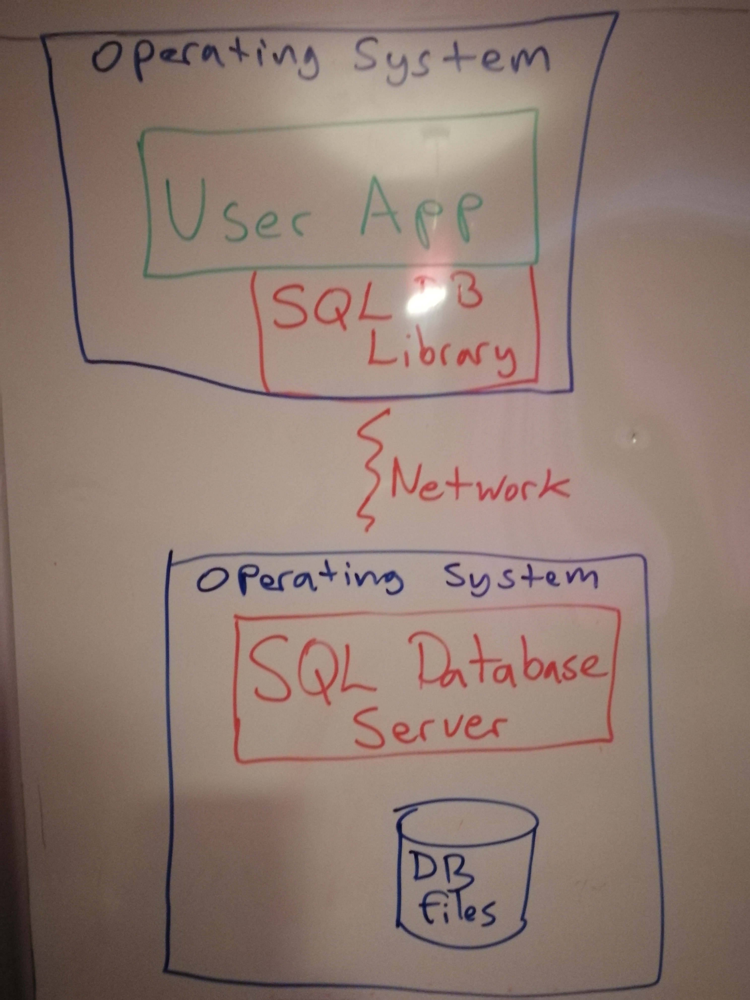
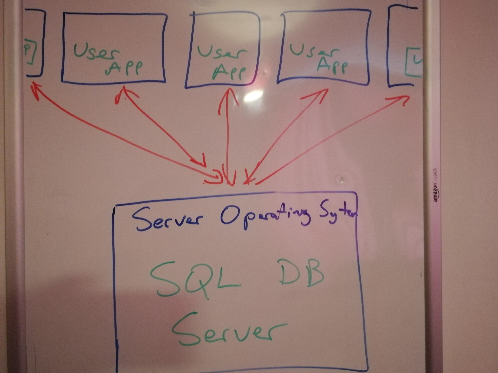
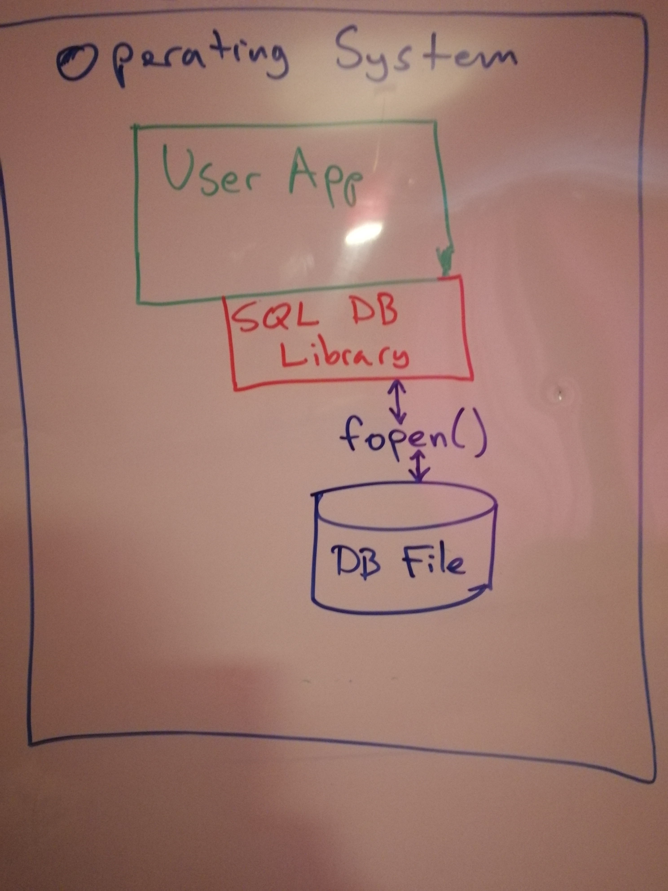
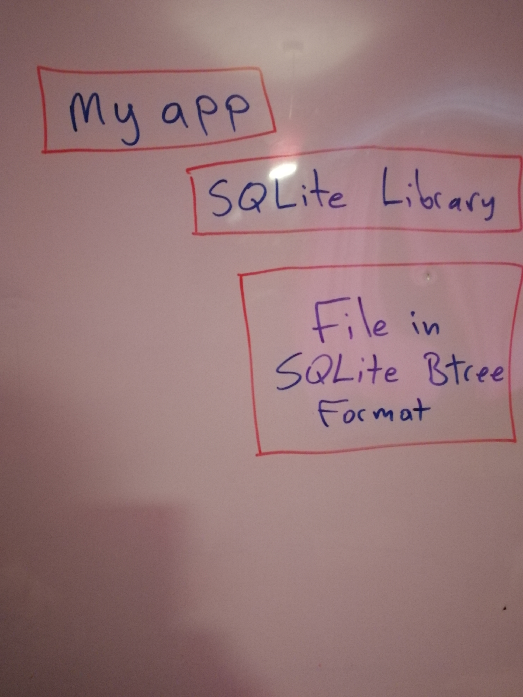

<!-- SPDX-License-Identifier: CC-BY-SA-4.0 -->
<!-- SPDX-FileCopyrightText: 2020 The LumoSQL Authors -->
<!-- SPDX-ArtifactOfProjectName: LumoSQL -->
<!-- SPDX-FileType: Documentation -->
<!-- SPDX-FileComment: Original by Dan Shearer, 2020 -->

LumoSQL Architecture
====================

Table of Contents
=================

# Online Database Servers

# SQLite as an Embedded Database

<!-- SPDX-License-Identifier: CC-BY-SA-4.0 -->
<!-- SPDX-FileCopyrightText: 2020 The LumoSQL Authors -->
<!-- SPDX-ArtifactOfProjectName: LumoSQL -->
<!-- SPDX-FileType: Documentation -->
<!-- SPDX-FileComment: Original by Dan Shearer, 2020 -->

LumoSQL
=======

Table of Contents
=================

Welcome to the LumoSQL project, which builds on the excellent
[SQLite](https://sqlite.org/).  LumoSQL is an SQL database which can be used in
embedded applications identically to SQLite, but also optionally with different storage
backends and other additional behaviour. LumoSQL emphasises benchmarking, code
reuse and modern database implementation.

* [Quick Start](./lumo-quickstart.md)
* [LumoSQL Project Aims](./lumo-project-aims.md)
* LumoSQL in Technical Detail
    + [Architecture](./lumo-architecture.md)
    + [Implementation](./lumo-implementation.md)
* [The LumoSQL Ecosystem](./lumo-ecosystem.md)
* [Benchmarking](./lumo-benchmarking.md)
* [Legal Aspects](./lumo-legal-aspects.md)
* [LumoSQL Documentation Standards](./lumo-doc-standards.md)

The following table shows how SQLite already has multiple deployment options:

# Why the Architecture Needs to Change

# LumoSQL Architecture

