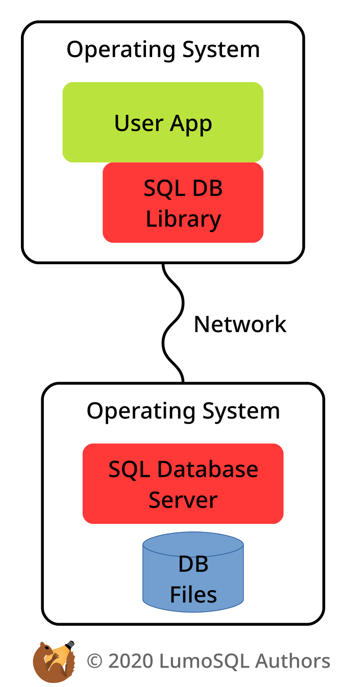
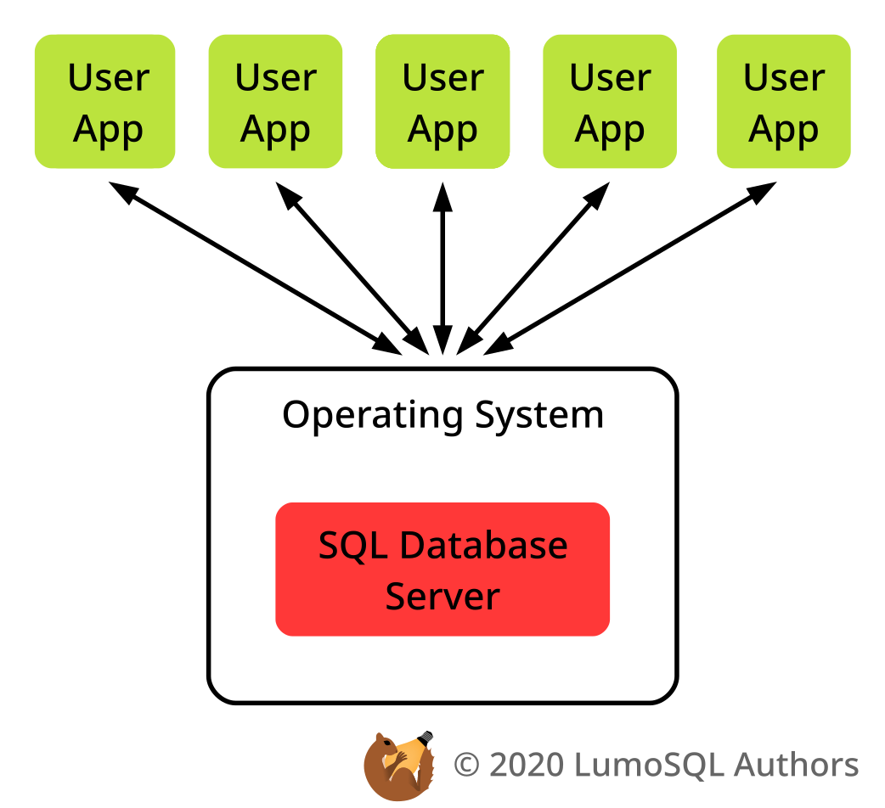
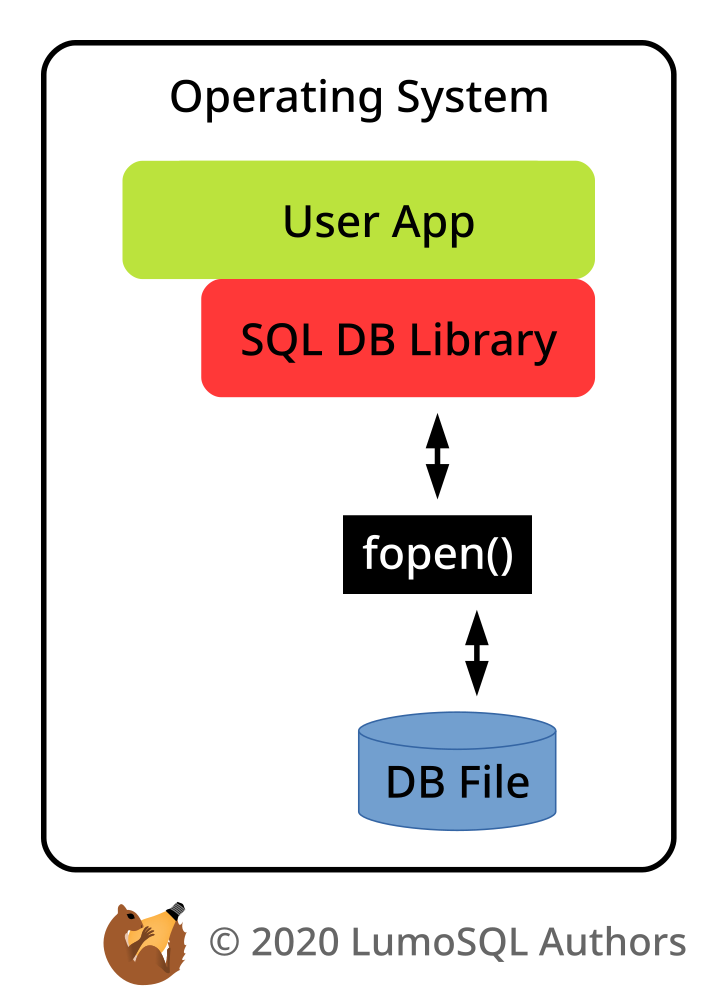
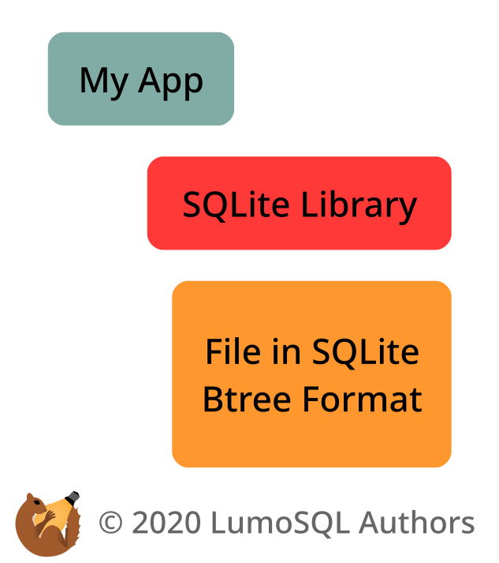

<!-- SPDX-License-Identifier: CC-BY-SA-4.0 -->
<!-- SPDX-FileCopyrightText: 2020 The LumoSQL Authors -->
<!-- SPDX-ArtifactOfProjectName: LumoSQL -->
<!-- SPDX-FileType: Documentation -->
<!-- SPDX-FileComment: Original by Dan Shearer, 2020 -->

LumoSQL Architecture
====================

Table of Contents
=================

# Online Database Servers

# SQLite as an Embedded Database

LumoSQL
=======

